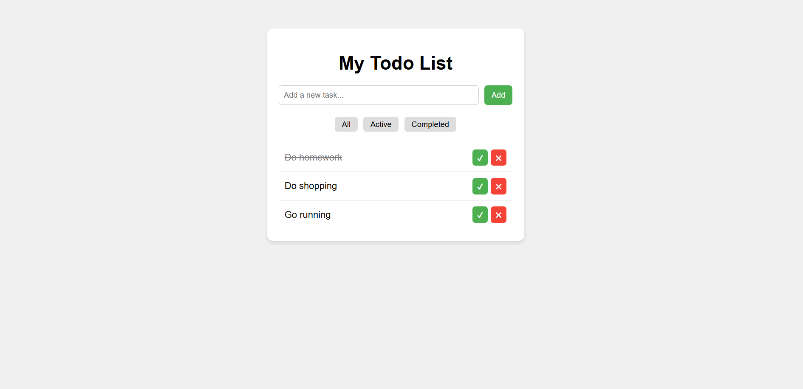

# 📝Todo-List

A simple task management app (Todo List) built with HTML, CSS, and JavaScript.
This project lets you add, remove, and mark tasks as completed in your daily to-do list.

---
## 🚀 Live Demo
🔗 https://react-todo-list4.netlify.app/

---

## 📸 Preview



---

📌 Features

✅ Add new tasks

✅ Remove tasks

✅ Mark tasks as completed

✅ Organized task list view

---

## 🛠️ Built With

- React
- Vite
- JavaScript (ES6+)
---

## 📂 Project Structure

```bash
src/
├── components/
│   ├── Form.jsx
│   ├── Items.jsx
├── App.jsx
└── main.jsx
```

🚀 Quick Start

To run this project on your local machine:

1. Clone the repository:
```
git clone https://github.com/Alireza-rh/Todo-List.git
```
2. Go into the project folder:
```
cd Todo-List
```
Install dependencies:
```
npm install
```
Run the development server:
```
npm run dev
```

Build for production:
```
npm run build
```
---

📬 Contact

GitHub: https://github.com/Alireza-rh

LinkedIn: https://www.linkedin.com/in/alireza-rohani


